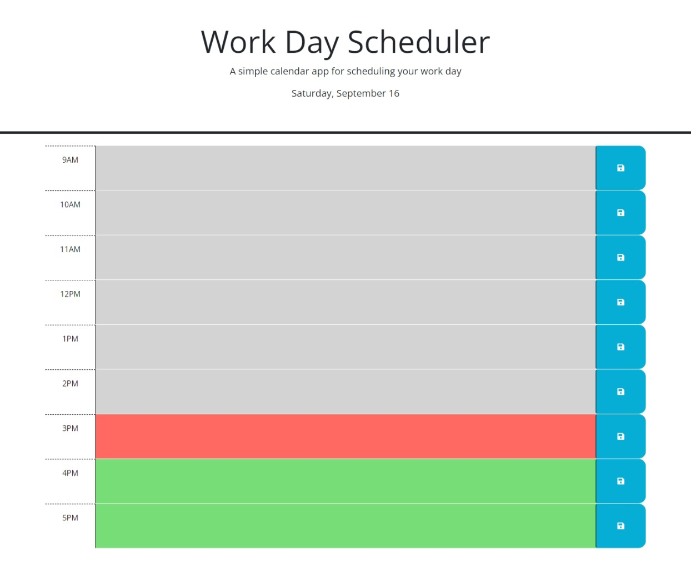

# Workday Scheduler

## Description

This is a scheduler for a single workday.  When the app is loaded, the current date displays in the header, timeslot for the working hours 9AM - 5pm are generated, and the timeblocks are color coded based on the current time.  Each timeslot has text areas that can be filled in with tasks for the particular time, and pressing the save button to the right of the text area will save the text locally, so that when the page is refreshed, the text will remain in the text area.

This project was created as an exercise to practice using local storage and practive creating html elements through JavaScript by navigating the DOM.

Link to site: [https://adamywfong.github.io/workday-scheduler/](https://adamywfong.github.io/workday-scheduler/).

